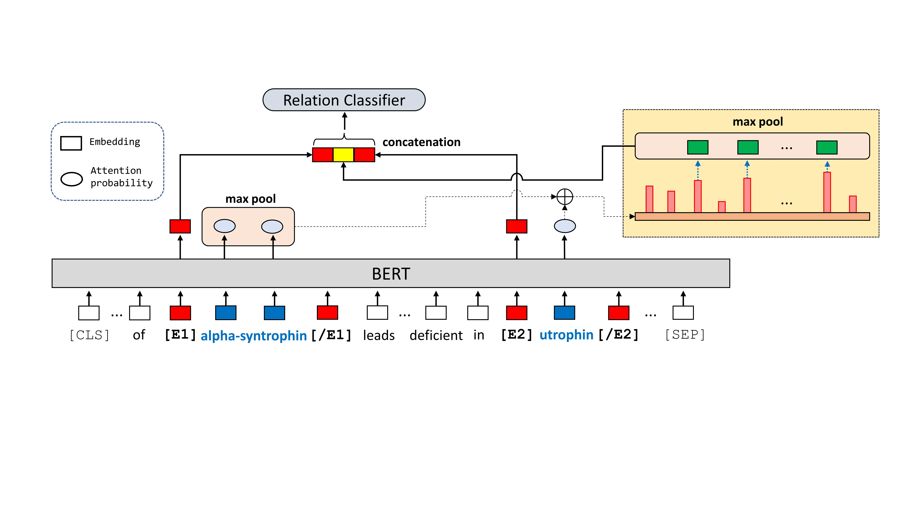

# PPI-Relation-Extraction
This is the official code of the paper:

Protein-Protein Interactions (PPIs) Extraction from Biomedical Literature using Attention-based Relational Context Information (link will be added.)

## Overview
The project aims to build a Protein-Protein Interaction (PPI) extraction model based on Transformer architecture. 
We used the five PPI benchmark datasets and four biomedical relation extraction (RE) datasets to evaluate our model.
We provide the extended version of PPI datasets, called typed PPI, which have further augmented those positive/negative calls with own PPI role labels (structural or enzymatic). <br/>


*Model Architecture Figure: The representation consists of entity start markers and the max-pooled of relational context which is a series of tokens chosen by attention probability
of the entities. If markers are unused, entity start markers are replaced with the max-pooled of two entity contextualized embeddings. The example sentence is ”Absence of alpha-syntrophin leads to structurally aberrant neuromuscular synapses deficient in utrophin.” (source from:
BioInfer corpus)*

## Installation
The code was implemented on Python version 3.9 and and PyTorch version = 1.10.2. The versions of the dependencies are listed in requirements.txt

## Datasets
** Please refer the [README.md](datasets/README.md) in the datasets directory.


## Reproduction
To reproduce the results of the experiments, use the following command:

```bash
export SEED=1
export DATASET_DIR=PPI-Relation-Extraction/datasets
export OUTPUT_DIR=PPI-Relation-Extraction/YOUR-OUTPUT-DIR

# PPI benchmark
export DATASET_NAME=PPI/original/AImed
			
python PPI-Relation-Extraction/src/relation_extraction/run_re.py \
  --model_list dmis-lab/biobert-base-cased-v1.1 \
  --task_name "re" \
  --dataset_dir $DATASET_DIR \
  --dataset_name $DATASET_NAME \
  --output_dir $OUTPUT_DIR \
  --do_train \
  --do_predict \
  --seed $SEED \
  --remove_unused_columns False \
  --save_steps 100000 \
  --per_device_train_batch_size 16 \
  --per_device_eval_batch_size 32 \
  --num_train_epochs 10 \
  --optim "adamw_torch" \
  --learning_rate 5e-05 \
  --warmup_ratio 0.0 \
  --weight_decay 0.0 \
  --relation_representation "EM_entity_start" \
  --use_context "attn_based" \
  --overwrite_cache \
  --overwrite_output_dir
```

Refer to the bash script [run.sh](script/run.sh), and you can find the hyperparameter settings of the datasets in [hyper-parameters-configuration.txt](config/hyper-parameters-configuration.txt)

## Results
Here are the results of the experiments. The model was trained on the machine, Tesla V100-SXM2-32GB × 2. Note different number of GPUs and batch size can produce slightly different results.


### Biomedical Relation Extraction benchmark data ###
   
<table>
    <tr>
        <th>Method</th>
        <th>ChemProt</th>
        <th>DDI</th>
        <th>GAD</th>
        <th>EU-ADR</th>
    </tr>
	<tr>
        <th>SOTA</th>
        <td>77.5</td>
        <td>83.6</td>
        <td>84.3</td>
        <td>85.1</td>
    </tr>
    <tr>
        <th>Ours (Entity Mention Pooling + Relation Context)</th>
        <td>80.1</td>
        <td>81.3</td>
        <td>85.0</td>
        <td>86.0</td>
    </tr>
    <tr>
        <th>Ours (Entity Start Marker + Relation Context)</th>
        <td>79.2</td>
        <td>83.6</td>
        <td>84.5</td>
        <td>85.5</td>
    </tr>
</table>

### PPI benchmark data ###
     
<table>
    <tr>
        <th>Method</th>
        <th>AIMed</th>
        <th>BioInfer</th>
        <th>HPRD50</th>
        <th>IEPA</th>
		<th>LLL</th>
		<th>Avg.</th>
    </tr>
	<tr>
        <th>SOTA</th>
        <td>83.9</td>
        <td>90.3</td>
        <td>85.5</td>
        <td>84.9</td>
		<td>89.2</td>
        <td>86.5</td>
    </tr>
    <tr>
        <th>Ours (Entity Mention Pooling + Relation Context)</th>
        <td>90.8</td>
        <td>88.2</td>
        <td>84.5</td>
        <td>85.9</td>
		<td>84.6</td>
        <td>86.8</td>
    </tr>
    <tr>
        <th>Ours (Entity Start Marker + Relation Context)</th>
        <td>92.0</td>
        <td>91.3</td>
        <td>88.2</td>
        <td>87.4</td>
		<td>89.4</td>
        <td>89.7</td>
    </tr>
</table>

### Typed PPI data ###

<table>
    <tr>
        <th>Method</th>
        <th>Typed PPI</th>
    </tr>
    <tr>
        <th>Ours (Entity Mention Pooling + Relation Context)</th>
        <td>86.4</td>
    </tr>
    <tr>
        <th>Ours (Entity Start Marker + Relation Context)</th>
        <td>87.8</td>
    </tr>
</table>


## Citation
TBA

<!-- reference from NBFNet
```bibtex
@article{zhu2021neural,
  title={Neural bellman-ford networks: A general graph neural network framework for link prediction},
  author={Zhu, Zhaocheng and Zhang, Zuobai and Xhonneux, Louis-Pascal and Tang, Jian},
  journal={Advances in Neural Information Processing Systems},
  volume={34},
  year={2021}
}
```
-->

<!--
### Prerequisites
Install the following packages.

* HuggingFace Transformers (https://github.com/huggingface/transformers)
* Scikit-learn (https://scikit-learn.org)

## License
This project is licensed under the MIT License - see the [LICENSE.md](LICENSE.md) file for details

## Acknowledgments
* This work has been authored by employees of Brookhaven Science Associates, LLC operated under Contract No. DESC0012704. The authors gratefully acknowledge the funding support from the Brookhaven National Laboratory under the Laboratory Directed Research and Development 18-05 FY 18-20.
-->