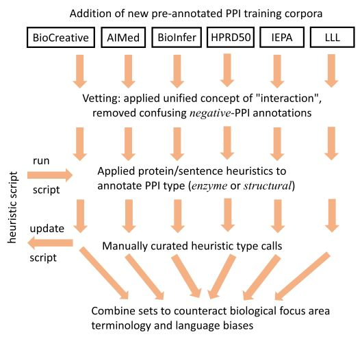

# Datasets
The pre-processed data for the experiments.

## Biomedical Relation Extraction benchmark data
There are various versions of the [ChemProt](https://www.ncbi.nlm.nih.gov/pmc/articles/PMC6051439/), [DDI](https://www.sciencedirect.com/science/article/pii/S1532046413001123?via%3Dihub), and [GAD](https://bmcbioinformatics.biomedcentral.com/articles/10.1186/s12859-015-0472-9) datasets. Here, we adopt the recent and widely used
benchmark data, the Biomedical Language Understanding and Reasoning Benchmark ([BLURB](https://dl.acm.org/doi/pdf/10.1145/3458754)). We also
use the [EU-ADR](https://www.sciencedirect.com/science/article/pii/S1532046412000573) data in [BioBERT](https://academic.oup.com/bioinformatics/article/36/4/1234/5566506).

* The ChemProt, DDI, and GAD datasets consist of a train/validation/test set, while the EU-ADR contains 10-fold sets for cross validation.
* "EU-ADR_BioBERT (train & validation)" is used for the evaluation on different relation context size (detailed in Appendix D in our paper). 
* In all of the data, target entities are anonymized with predefined tags, including `@GENE$`, `@CHEMICAL$`, `@DRUG$`, and `@DISEASE$`. 
* In ChemProt and DDI, additional tags, `@CHEM-GENE$` and `@DRUG-DRUG$`, are used for overlapping entities. 
When entity markers are used, `@CHEM-GENE$` and `@DRUG-DRUG$` are surrounded by the `[E1-E2]` tag.

Table shows the statistics of biomedical relation extraction datasets.

<table>
    <tr>
        <th></th>
        <th>Train</th>
        <th>Dev</th>
        <th>Test</th>
        <th>Total</th>
    </tr>
	<tr>
        <th>ChemProt</th>
        <td>18,035</td>
        <td>11,268</td>
        <td>15,745</td>
        <td>45,048</td>
    </tr>
    <tr>
        <th>DDI</th>
        <td>25,296</td>
        <td>2,496</td>
        <td>5,716</td>
		<td>33,508</td>
    </tr>
    <tr>
        <th>GAD</th>
        <td>4,261</td>
        <td>535</td>
        <td>534</td>
		<td>5,330</td>
    </tr>
	<tr>
        <th>EU-ADR</th>
        <td>*NA*</td>
        <td>*NA*</td>
        <td>*NA*</td>
		<td>355</td>
    </tr>
</table>


## PPI benchmark data
We adopt the unified version of PPI benchmark datasets ([AIMed](https://www.sciencedirect.com/science/article/pii/S0933365704001319), 
[BioInfer](https://link.springer.com/article/10.1186/1471-2105-8-50), 
[HPRD50](https://academic.oup.com/bioinformatics/article/23/3/365/236564),
[IEPA](http://psb.stanford.edu/psb-online/proceedings/psb02/ding.pdf),
[LLL](https://hal.inrae.fr/hal-02762818/document)) provided by [Pyysalo et al., 2008](https://bmcbioinformatics.biomedcentral.com/articles/10.1186/1471-2105-9-S3-S6) that has been used in the SOTA models. 
* In the datasets, the PPI relations are tagged with either *positive* or *negative*. 
* The data contains 10-fold sets for cross validation.

Table shows the statistics of five ppi benchmark corpora for *positive* and *negative* classes.

<table>
    <tr>
        <th></th>
        <th>Positive</th>
        <th>Negative</th>
    </tr>
	<tr>
        <th>AIMed</th>
        <td>1,000</td>
        <td>4,834</td>
    </tr>
    <tr>
        <th>BioInfer</th>
        <td>2,534</td>
        <td>7,132</td>
    </tr>
	<tr>
        <th>HPRD50</th>
        <td>163</td>
        <td>270</td>
    </tr>
    <tr>
        <th>IEPA</th>
        <td>335</td>
        <td>482</td>
    </tr>
    <tr>
        <th>LLL</th>
        <td>164</td>
        <td>166</td>
    </tr>
	<tr>
        <th>TOTAL</th>
        <td>4,196</td>
        <td>12,884</td>
    </tr>
</table>

## Typed PPI data
Our PPI annotations with interaction types (*enzyme*, *structural*, or *negative*) are the expanded version of the five PPI benchmark corpora and the [BioCreative VI](https://academic.oup.com/database/article/doi/10.1093/database/bay147/5303240) protein interaction dataset (Track 4: Mining protein interactions and mutations for precision medicine (PM)).
* The data is a 10-fold set for cross validation.
* You can find the annotation rules and comments [here](PPI/type_annotation/annotation_resources).

Table displays the corpora statistics. The annotation work in all corpora has been carried out in a sentence boundary as engaged in the five PPI benchmark corpora.
The significant reduction from the original data in *negative* samples is explained in the section III-A3 in our paper (TODO: add a link).


<table>
    <tr>
        <th></th>
        <th>Enzyme</th>
        <th>Structural</th>
        <th>Negative</th>
    </tr>
	<tr>
        <th>BioCreative VI</th>
        <td>378</td>
        <td>83</td>
        <td>0</td>
    </tr>
    <tr>
        <th>AIMed</th>
        <td>548</td>
        <td>182</td>
        <td>1,371</td>
    </tr>
    <tr>
        <th>BioInfer</th>
        <td>604</td>
        <td>1,465</td>
        <td>2,148</td>
    </tr>
	<tr>
        <th>HPRD50</th>
        <td>103</td>
        <td>34</td>
        <td>87</td>
    </tr>
    <tr>
        <th>IEPA</th>
        <td>271</td>
        <td>2</td>
        <td>224</td>
    </tr>
    <tr>
        <th>LLL</th>
        <td>163</td>
        <td>0</td>
        <td>0</td>
    </tr>
	<tr>
        <th>TOTAL</th>
        <td>2,067</td>
        <td>1,766</td>
        <td>3,830</td>
    </tr>
</table>

<< Annotation process diagram >>




## Citation
If you use the Typed PPI data for your research, please cite the following paper.

```bibtex
@inproceedings{park2022extracting,
  title={Extracting Protein-Protein Interactions (PPIs) from Biomedical Literature using Attention-based Relational Context Information},
  author={Park, Gilchan and McCorkle, Sean and Soto, Carlos and Blaby, Ian and Yoo, Shinjae},
  booktitle={2022 IEEE International Conference on Big Data (Big Data)},
  pages={2052--2061},
  year={2022},
  organization={IEEE}
}
```
